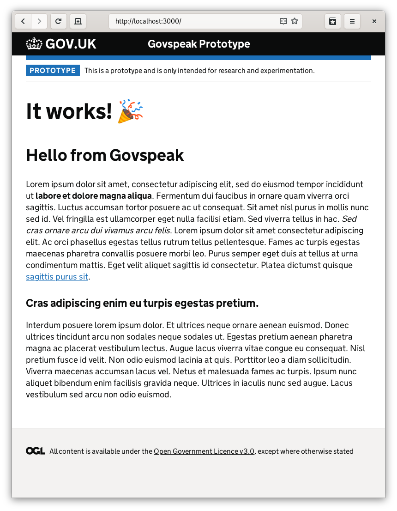

# Govspeak Prototype

This is a minimal prototype kit aimed at testing and researching content that's
intended to be published via the [Whitehall Publisher](https://www.gov.uk/guidance/how-to-publish-on-gov-uk).

It uses [Nanoc](https://nanoc.ws/), a static site generator written in Ruby.

## What is govspeak?

[Govspeak](https://github.com/alphagov/govspeak) is a simplified 'markup'
language based on [Markdown](https://commonmark.org/). It's designed to be as
[easy-to-read and easy-to-write](https://govspeak-preview.herokuapp.com/guide)
as possible.

## Requirements
- [Ruby](https://www.ruby-lang.org/en/documentation/installation/#homebrew)
- [NPM](https://www.npmjs.com/get-npm)

## Getting started

Clone this app, `cd` to the repo's root directory and run:

``` bash
$ npm install
$ bundle install
```

If that succeeded, we can start the app and have it live reload our changes:

```bash
$ bundle exec nanoc live
```

Navigate to `http://localhost:3000` and if you see this, it worked!



## Adding content

To add a new page create a `.gs` file in the `content` directory,
`content/example.gs` for example. The page will now be visible at
`http://localhost:3000/example`.

For consistency, keep your filenames lower case, avoid non-alphanumeric characters and use
dashes instead of spaces.

### Frontmatter

Frontmatter is a block of YAML at the top of a file that contains metadata. By
default, this app only makes use of the title, but any structured data can
added.

```
---
title: "My amazing page"
---
```

View the included index file `content/index.gs` for an example of using
metadata in a govspeak template.

### Nesting pages

A hierarchy of content can be created using directories. Each directory should have
a corresponding index, so the `hello/` directory should be placed alongside `hello.gs`.

| File                                | Path                                           |
| ----                                | ----                                           |
| `content/hello.gs`                  | `http://localhost:3000/hello`                  |
| `content/hello/world.gs`            | `http://localhost:3000/hello/world`            |
| `content/hello/nice-to-meet-you.gs` | `http://localhost:3000/hello/nice-to-meet-you` |

Routing and breadcrumbs are automatically handled.

### Level one headings (or lack thereof)

Govspeak [does not support level one
headings](https://govspeak-preview.herokuapp.com/guide#Headings) by choice. The
document's title will be displayed in a `<h1>` tag at the top of the page, all
subsequent headings should be `<h2>`-`<h6>`.

The default styling for additional `<h1>` tags is intentionally ugly to
discourage their use.
